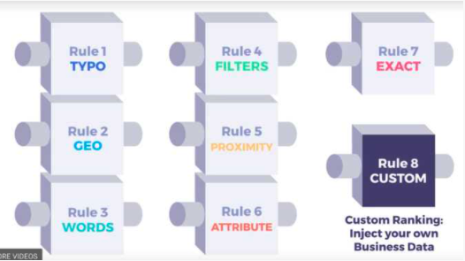

# Algolia入門

## 基礎知識

### Algoliaとは
- 検索API
- 全文検索をするSaas
- Firebaseで検索を実現するクエリやAPIは用意されてないので、Firebaseと相性○
<br>
<br>

### 検索を行うデータ
- Algoliaの中でJSON型式でデータを保持し、その中で検索をする
- Algoliaにもデータを入れなきゃいけないので、データが重複することになる
- データの扱いはキャッシュと同じように扱うのが良いので、RDSやFirebaseのデータを主とする。
- 主データに対してCREATE/UPDATE/DELETEが行われたら、Algoliaにも命令をする形式がベター
<br>
<br>

### RDSと対応した用語
- RDBにおけるテーブル・レコード・カラムがAlgoliaだと少し違う用語になっている。

| RDB | Algolia | MEMO |
| :---: | :---: | :---: |
| Table | Index | 複数形式はindicies → レコードの集合体 |
| Record | Record | Attributeの集合体 |
| Column | Attribute | key/valueペア値の集合体 |

丸暗記必須!!
<br>
<br>

### Algoliaの検索までの流れ
- 検索機能を使うまでに、大きく分けて3つのフローに別れる。
```
①DataSync = Algoliaにデータを入れる

②Ranking = Algolia内部でインデックスを作成してくれる

③Fetch = 検索をかけると理想的な結果が表示される
```
②はAlgolia側で行ってくれるので、Developerが行うのは①/③のみなので直感的<br>
（②は、Index-timeとも書かれている）
<br>
<br>

### 提供されているAPI
- APIかコンポーネントの２種類ある
- APIではRubyやPHPなどから呼び出し
- コンポーネントはReact・Vue・Avgular用のコンポーネント単位の機能が用意されている。
<br>
<br>

## 用語知識
### Synonyms
- 同義異音を定義する、単純な英単語
- アプリのビジネスドメインによって発生するであろうものをユーザーが定義出来る。PC＝パソコン的な
<br>
<br>

### Ranking formula
- 検索結果をどの順番で表示させるか？という計算アルゴリズム
- 具体的に「tie-breaking アルゴリズム」→「ソート」→「ranking-criteria(8つのルール)」の優先度で、表示する内容・順番を決めている。
- custom-rankingを設定していると、ranking-criteriaの8つ目のルールとしてソートが行われる。

### RankingCriteria


### データサイズはできるだけ小さく
- 検索用・表示用・ソート用だけに絞り、それ以外のデータは保存しないが公式提供のプラクティス
- 仮にAttributeが増える場合は、既存のRecodeに対してもAttributeを更新すれば良い

